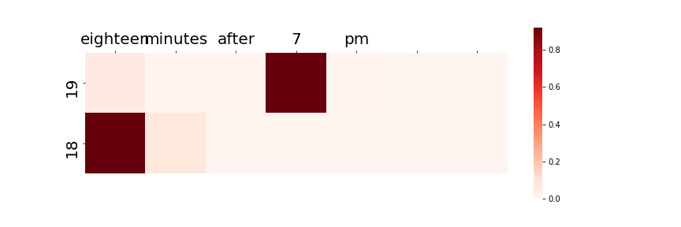

# TimeAttentionKeras
Getting the precise time from oral expressions by `Bahdanau Attention` Model based on the Keras.  
Reference: 《Neural Machine Translation by Jointly Learning to Align and Translate》
#### Task
To extract the moment of time from a oral sentence, just 
like from `eighteen minutes after 7 pm` to `19 18`. I make
 a Seq2Seq model based on Attention to realize it.  

#### Examples
* input: `"2:33"`
* output: `02 33`
* attention:  

* input: `"twenty eight minute before 9"`
* output: `08 32`
* attention:  

* input: `"eighteen minutes after 7 pm"`
* output: `19 18`
* attention:  

* input: `"ten hour and twenty eight"`
* output: `10 28`
* attention:  

* input: `"half past eleven"`
* output: `11 30`
* attention:  

* input: `"quarter after sixteen"`
* output: `16 45`
* attention:  

##### Author
欢迎交流  
wechat:`dengxiuqi007`  
2019.6